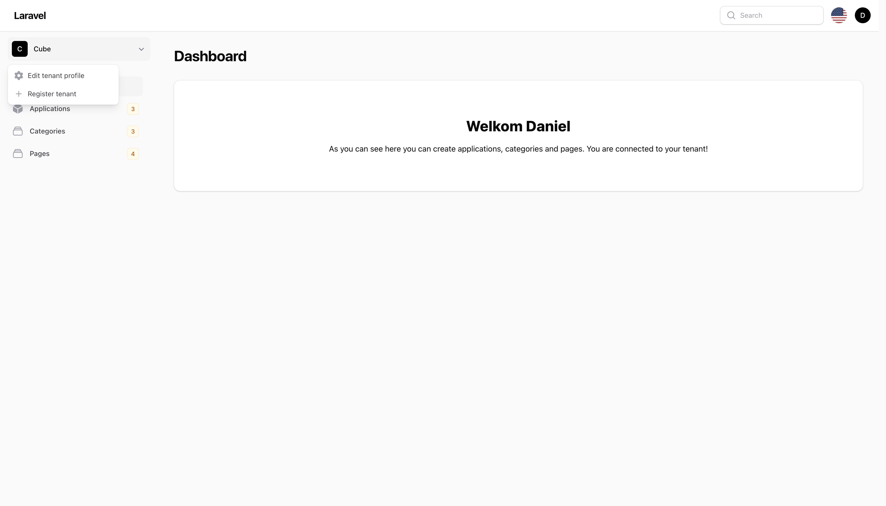
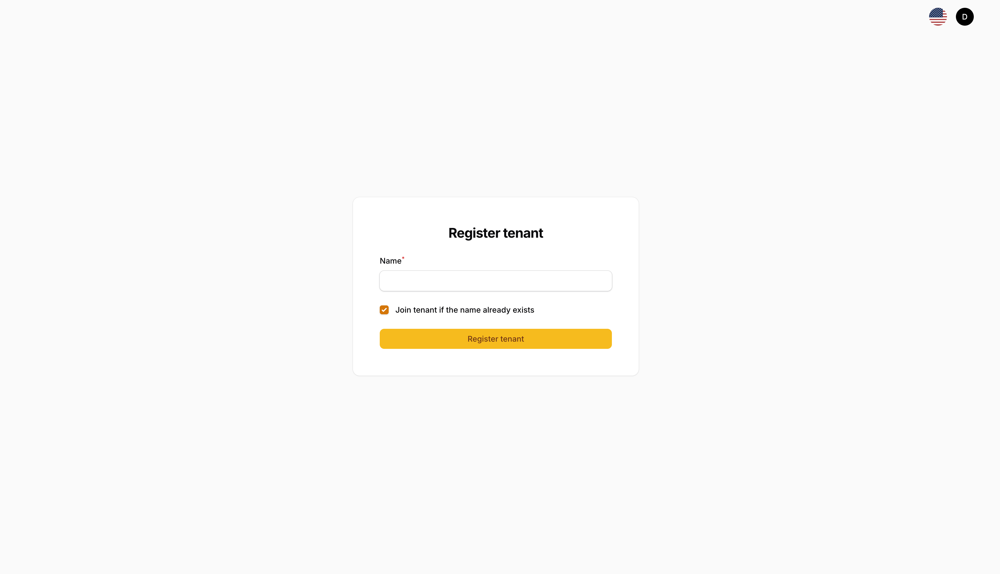
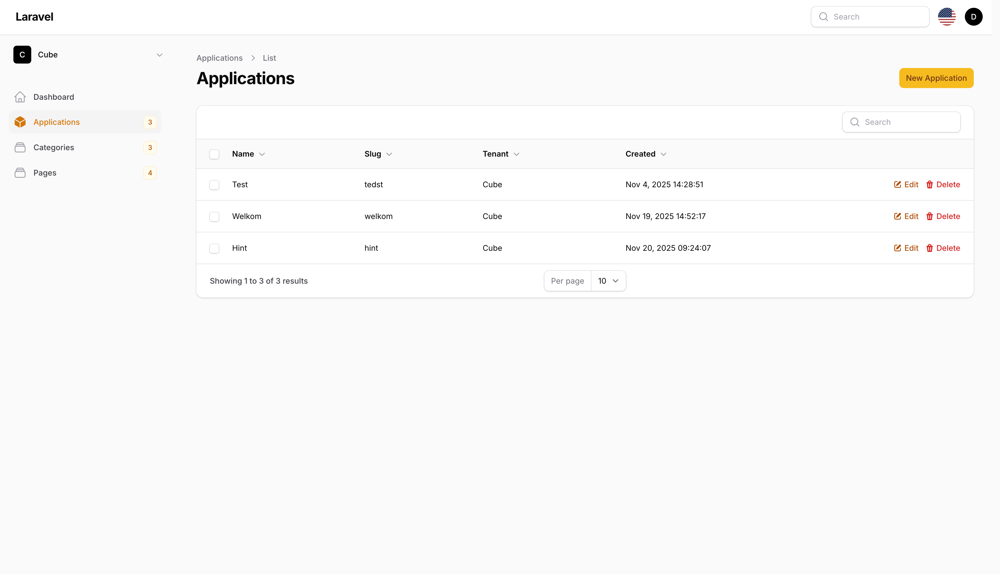
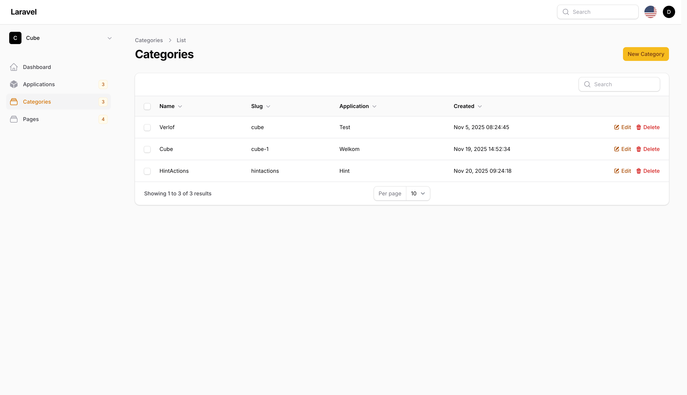
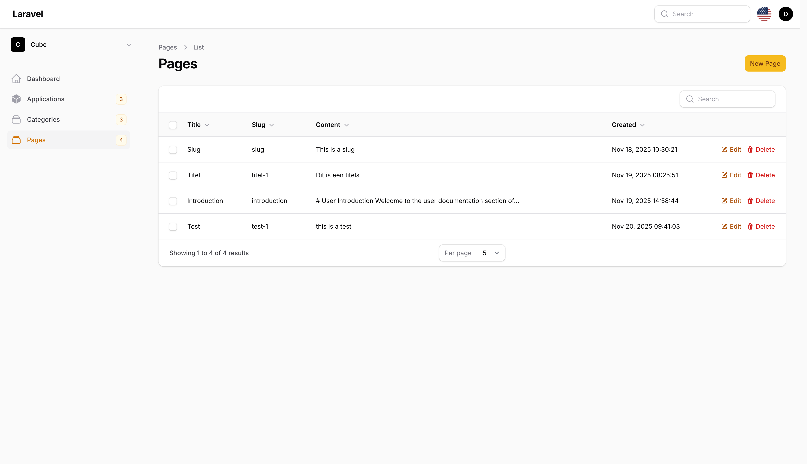

# Cube Wiki API – Multitenant Knowledge Management Platform
Welcome to Cube Wiki, a multitenant knowledge-management platform built with Filament.
Cube Wiki offers a structured way to manage documentation through Applications, Categories, and Pages.
## Showcase
### User






### Admin
The admin interface is similar to the user interface, but includes additional management tools:
- View all users
- View and manage all tenants
- Create Tenants and users
- Assign users to tenants
## Introduction
Cube Wiki is a multitenant knowledge-management platform built with Filament.
The system allows administrators to manage tenants, users, applications, 
categories, and pages—all separated per tenant. Every page is written in 
Markdown and exposed through the Cube Wiki API so it can easily be used inside your own categories which is 
connected to one application.

## Features
### Multitenancy
- Each user can belong to one or multiple tenants.
- All data is fully isolated per tenant.
- Users can create new tenants or switch between existing one if you joined them.
- Users can join existing tenants if possible.
### Admin features
- Create tenants - each tenant recieves its own API token with Sanctum.
- Create and manage users.
- Assign users to one or multiple tenants.
- Full acces to manage all tenant data.
### Users features
- Create and edit applications, categories and pages inside their tenants.
- Write pages using the build in Markdown editor.
- Switch between tenants.
- Join existing tenants if possible.

## Applications, Categories and Pages
### Applications
- Create applications with a name — slugs are generated automatically.
- Applications act as the top level container for documentation
### Categories
- Create categories with an auto-generated slug.
- Each category must be linked to an application (selectable via dropdown).
### Pages
- Create pages with auto-generated slugs.
- Each page must be linked to a category
- Markdown editor for writing content.
- Markdown is stored as is and served via the API.

## Slug generation
Slug is automatically generated from the name of the application, category or page with 
Spatie Sluggable package. When you create an application, category or page the slug will stay
So if you edit the name the slug will not change. So the links to the pages will not break.

Slug is used in the API for a cleaner URL structure.

## API overview
Each tenant receives one API token, generated by admin.
This token provides access to all data belonging to that tenant.
The API returns the complete hierarchical structure:

Tenant → Applications → Categories → Pages

## Summary
Cube Wiki is flexible and scalable multitenant wiki System with:
- Applications → Categories → Pages structure
- Markdown support
- API access per tenant
- Automatic slug generation
## Testing

```bash
composer test
```

## Changelog

Please see [CHANGELOG](CHANGELOG.md) for more information on what has changed recently.

## Contributing

Please see [CONTRIBUTING](CONTRIBUTING.md) for details.

## Security Vulnerabilities

Please review [our security policy](../../security/policy) on how to report security vulnerabilities.

## Credits

- Spatie - Sluggable package is used for slug generation
  of [Spatie's Sluggable ](https://github.com/spatie/laravel-sluggable)

## License

The MIT License (MIT). Please see [License File](LICENSE.md) for more information.
